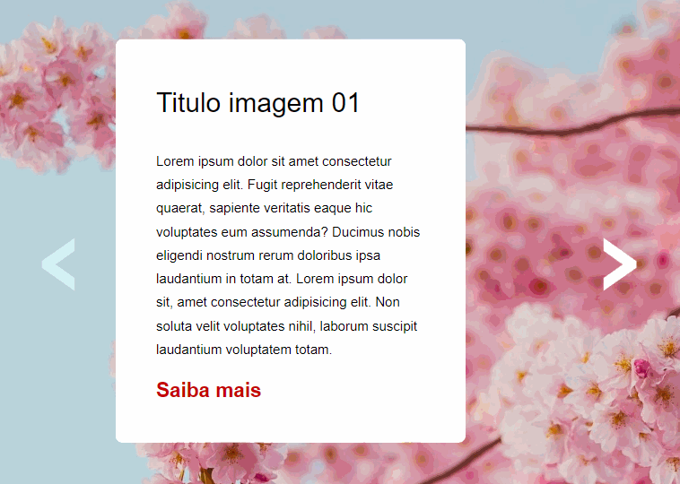

# Carrocel



## Propósito

Este projeto tem como objetivo apresentar um carrossel interativo e responsivo, desenvolvido utilizando HTML, CSS e JavaScript. O principal propósito é proporcionar uma experiência visual envolvente, destacando a transição entre quatro imagens distintas.
## Funcionalidades

1. **Carrossel Interativo:**

   - Implementação de um carrossel que permite a navegação entre quatro imagens distintas. Os usuários podem avançar para a próxima imagem clicando na seta à direita, e a seta à esquerda fica desativada no primeiro slide para indicar que não é possível retroceder.

2. **Responsividade:**

   - Garantia de que o site ofereça uma experiência consistente em dispositivos de diferentes tamanhos. A interface é ajustada automaticamente para proporcionar uma visualização otimizada tanto em telas grandes quanto em dispositivos móveis.

3. **Atualização Dinâmica do "Saiba Mais":**

   - A cor do botão "Saiba Mais" é atualizada dinamicamente para corresponder à imagem em destaque.
    
## Ferramentas utilizadas

1. **HTML:**
   -  Estruturação do conteúdo.

2. **CSS:**
   - Estilização e apresentação visual.

3. **JavaScript:**
   - Lógica de validação e interatividade.

## Decisões de Projeto

1. **Separação de Responsabilidades em Arquivos:**
   - Mantive a separação de arquivos CSS para a melhor organização dos estilos e facilitar o desenvolvimento do projeto. Os arquivos CSS estão estruturados de acordo com a função e escopo, seguindo um padrão de nomenclatura claro.

## Como utilizar

1. Clone o repositório:

    ```bash
    git clone https://github.com/Paulo-Heber/Carrocel.git
    ```

2. Abra a pasta do projeto e dê dois cliques sobre o arquivo index.html.


